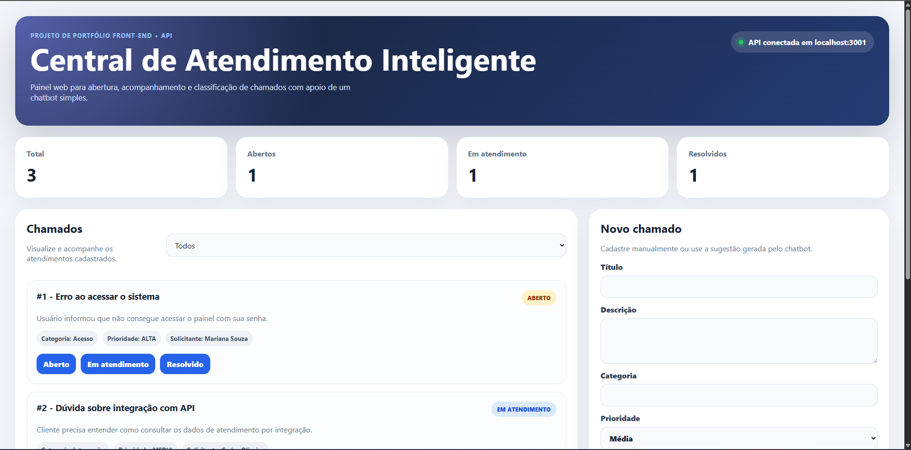
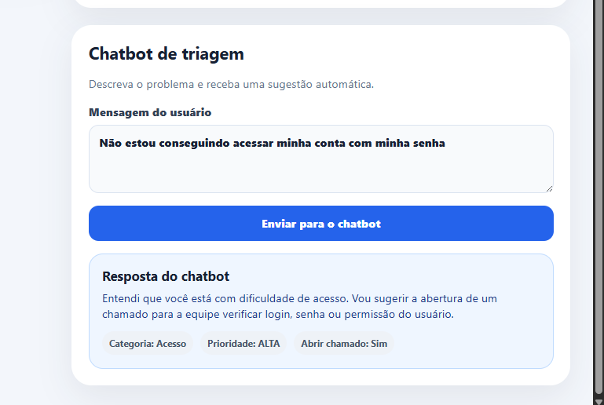
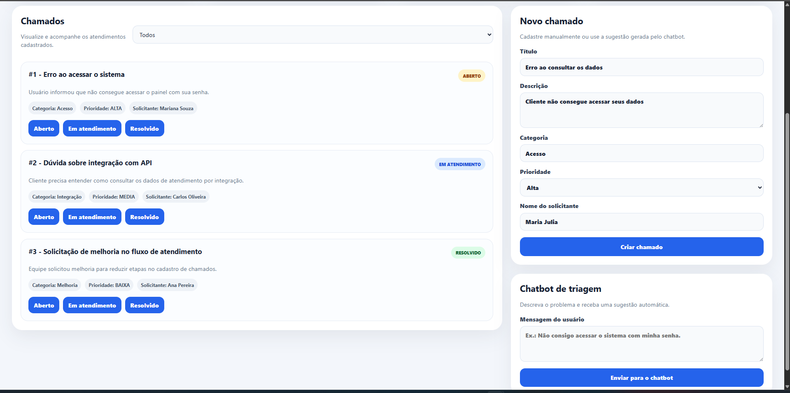

# Central de Atendimento Inteligente

Painel web para abertura, acompanhamento e triagem de chamados de suporte, com sugestão automática de categoria e prioridade a partir da mensagem do usuário.

Projeto de portfólio desenvolvido durante o curso de Sistemas de Informação da Universidade Federal de Uberlândia (UFU), com o objetivo de exercitar a integração completa entre front-end, API REST e banco de dados relacional.



---

## Funcionalidades

- Listagem de chamados com filtro por status (aberto / em atendimento / resolvido)
- Painel de métricas agregadas: total, abertos, em atendimento e resolvidos
- Abertura de chamados com validação no back-end
- Alteração de status diretamente pelo painel, com atualização imediata das métricas
- **Chatbot de triagem baseado em regras**: interpreta a mensagem do usuário e sugere título, categoria e prioridade, pré-preenchendo o formulário de abertura
- Indicador visual do estado da API (health check), exibido em tempo real na interface





---

## Stack

| Camada | Tecnologias |
|--------|-------------|
| Front-end | React 19, TypeScript, Vite, CSS |
| Back-end | Node.js, Express, TypeScript |
| Persistência | Prisma ORM, SQLite (migrations versionadas + seed) |
| Ferramentas | Git, GitHub, Oxlint, Concurrently |

---

## Arquitetura

```text
central-atendimento-inteligente/
├── api/
│   ├── prisma/
│   │   ├── migrations/      → histórico versionado do schema
│   │   ├── schema.prisma    → modelo de dados e enums
│   │   └── seed.ts          → carga inicial para desenvolvimento
│   └── src/
│       ├── controladores/   → rotas HTTP e validação de entrada
│       ├── servicos/        → regra de negócio
│       ├── modelos/         → tipos e contratos compartilhados
│       └── database/        → instância do Prisma Client
├── web/
│   └── src/
│       ├── services/api.ts  → única camada que conhece a API
│       ├── App.tsx          → composição da interface
│       └── App.css
└── docs/imagens/            → capturas de tela do sistema
```

A separação foi feita de modo que **o serviço não conheça o Express e o controlador não conheça o Prisma**. Na prática, isso significa que trocar o banco de dados afeta apenas a camada de serviço, e trocar o framework HTTP afeta apenas a camada de controladores.

No front-end, todo acesso à API está concentrado em `web/src/services/api.ts`, com os tipos de resposta declarados explicitamente. Nenhum componente faz `fetch` diretamente.

---

## Endpoints

| Método | Rota | Descrição |
|--------|------|-----------|
| `GET` | `/` | Identificação e versão da API |
| `GET` | `/saude` | Health check consumido pelo front-end |
| `GET` | `/chamados` | Lista chamados. Aceita `?status=ABERTO\|EM_ATENDIMENTO\|RESOLVIDO` |
| `GET` | `/chamados/:id` | Busca um chamado por ID |
| `GET` | `/chamados/metricas/resumo` | Contagem agregada por status |
| `POST` | `/chamados` | Cria um chamado |
| `PATCH` | `/chamados/:id/status` | Atualiza o status de um chamado |
| `POST` | `/chatbot/mensagem` | Executa a triagem de uma mensagem |

Exemplo de requisição ao chatbot:

```bash
curl -X POST http://localhost:3001/chatbot/mensagem \
  -H "Content-Type: application/json" \
  -d '{"mensagem":"Não consigo acessar o sistema com minha senha"}'
```

Resposta:

```json
{
  "resposta": "Entendi que você está com dificuldade de acesso...",
  "categoriaSugerida": "Acesso",
  "prioridadeSugerida": "ALTA",
  "deveAbrirChamado": true,
  "tituloSugerido": "Problema de acesso ao sistema"
}
```

---

## Como executar

Pré-requisitos: Node.js 20 ou superior.

```bash
git clone https://github.com/guilhermecastilhomachado/central-atendimento-inteligente
cd central-atendimento-inteligente
npm install
```

Configure e prepare a API:

```bash
cd api
cp .env.example .env          # no Windows: copy .env.example .env
npm install
npx prisma migrate dev
npm run db:seed
cd ..
```

Configure o front-end:

```bash
cd web
cp .env.example .env          # no Windows: copy .env.example .env
npm install
cd ..
```

Suba os dois serviços de uma vez, a partir da raiz:

```bash
npm run dev
```

| Serviço | Endereço |
|---------|----------|
| API | http://localhost:3001 |
| Front-end | http://localhost:5173 |

---

## Decisões técnicas

### Por que o chatbot é baseado em regras e não em um modelo de linguagem?

O componente de triagem é **determinístico**: classifica a mensagem por correspondência de palavras-chave, em ordem de precedência definida no código (`api/src/servicos/chatbotServico.ts`).

Foi uma escolha, não uma limitação. Para este escopo, regras determinísticas são **auditáveis**: é possível explicar exatamente por que uma mensagem recebeu determinada categoria e prioridade, e o resultado é reprodutível. Em um contexto de suporte, essa rastreabilidade costuma valer mais do que sofisticação, além de não introduzir custo de inferência nem dependência de serviço externo.

A limitação evidente é a ausência de compreensão semântica: sinônimos fora da lista não são reconhecidos. A evolução natural seria substituir as regras por classificação com embeddings ou por um modelo de linguagem — mas essa troca só faz sentido acompanhada de um conjunto de avaliação que comprove ganho real de acurácia sobre a baseline por regras. Sem isso, seria complexidade sem evidência.

### Por que SQLite?

Zero configuração para quem clona o repositório: não é necessário subir contêiner nem instalar servidor de banco. Como todo o acesso está isolado atrás do Prisma, migrar para PostgreSQL exige alterar apenas o `provider` no `schema.prisma` e a `DATABASE_URL` — nenhuma linha da camada de serviço muda.

### Por que validação com type guards?

Os controladores usam type guards do TypeScript (`function ehStatusValido(status: string): status is StatusChamado`) em vez de conversões com `as`. Isso garante que valores inválidos de status e prioridade sejam barrados na borda da aplicação, antes de chegarem ao banco, e que o compilador reconheça o estreitamento de tipo a partir daquele ponto.

---

## Limitações conhecidas

Documentadas de forma explícita por serem decisões conscientes de escopo, não descuidos:

- **Sem autenticação e autorização.** Qualquer cliente pode ler e alterar qualquer chamado.
- **Sem paginação.** `GET /chamados` retorna a coleção completa. Adequado ao volume de demonstração, inadequado para produção — a evolução seria paginação por cursor com `take`/`skip` do Prisma.
- **Sem `helmet` nem rate limiting.** A API não define cabeçalhos de segurança HTTP e não limita requisições por origem, o que a deixa exposta a abuso em um cenário público.
- **Sem testes automatizados** nesta versão (ver roadmap).
- **Triagem sem compreensão semântica**, conforme descrito acima.
- **Sem índice em `status`**, ainda que seja a coluna usada nos filtros e nas métricas.

---

## Roadmap

**Curto prazo**
- [ ] Testes automatizados com Vitest e Supertest, cobrindo o serviço de triagem e os endpoints de chamados
- [ ] Middleware global de tratamento de erros com classe `AppError`, eliminando os `try/catch` repetidos nos controladores
- [ ] Validação de entrada com Zod, substituindo as verificações manuais
- [ ] Documentação interativa com OpenAPI/Swagger
- [ ] Decomposição de `App.tsx` em componentes e hook `useChamados`

**Médio prazo**
- [ ] Containerização com Docker e Docker Compose
- [ ] Deploy: PostgreSQL gerenciado, API e front-end publicados
- [ ] Pipeline de CI no GitHub Actions executando lint e testes a cada push
- [ ] Tela de detalhe do chamado, consumindo o `GET /chamados/:id` já disponível
- [ ] `helmet`, rate limiting e índice em `status`

---

## Autor

**Guilherme Castilho Machado** — Sistemas de Informação, Universidade Federal de Uberlândia (UFU)

[LinkedIn](https://www.linkedin.com/in/guilhermecastilhom/) · [GitHub](https://github.com/guilhermecastilhomachado)

Licença MIT.
